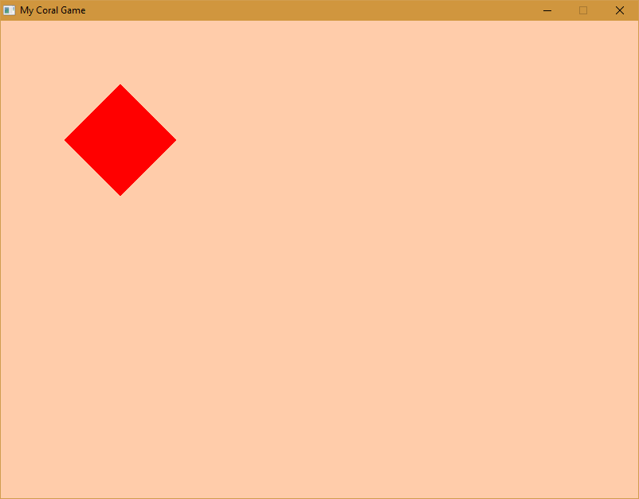

# Coral Framework

## Simple 2d game development platform for the Nim programming language (Warning) This framework is under heavy development

### Requires SDL2 Dynamic libraries for your specific platform 

[libsdl.org](https://www.libsdl.org/)

### Help support this project

[](https://www.paypal.com/cgi-bin/webscr?cmd=_s-xclick&hosted_button_id=H5PC5ZLB4GMPE)

## Getting Started

```nim
import
    Coral/game,
    Coral/graphics,
    Coral/renderer

Coral.draw = proc()=
    Coral.r2d.setBackgroundColor(P8Peach)
    Coral.r2d.drawRect(100, 100, 100, 100, 45.0, Red)

Coral.createGame(800, 600, "My Coral Game").run()
```
