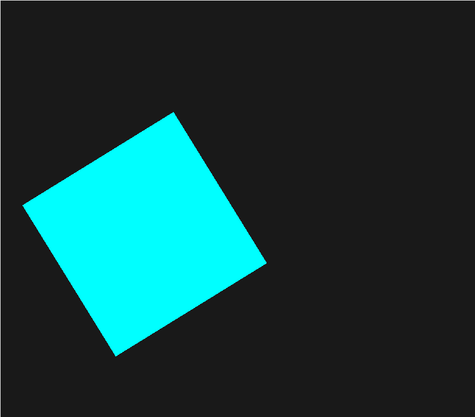

# Coral

## Coral is a simple, easy to use 2d game framework for the [Nim](https://nim-lang.org) programming language. Warning: Coral is under heavy development.

### Help support this project

[](https://www.paypal.com/cgi-bin/webscr?cmd=_s-xclick&hosted_button_id=H5PC5ZLB4GMPE)

## Getting started
```nim
import strformat
import
  ../../src/Coral,
  ../../src/Coralpkg/[art, cgl, platform]

initGame(1280, 720, ":)")
initArt()

while updateGame():
  clearColorAndDepthBuffers (0.1, 0.1, 0.1, 1.0)

  Window.title = &"FPS: {Time.framesPerSecond.int}"

  beginArt()

  setDrawColor (colorFromHex "00FFFF")
  drawRect 300, 200, 300, 300, 45.0

  endArt()
```

